**_Games Review_**

WELCOME TO GAMES REVIEW

Being a gamer my self I wanted to create a website database where user’s have control on the content that can be added to the database. Having played a lot of games I wanted to create something where people can add their honest opinions about games. The website uses a number of different languages and is a combination of POSTGRESSQL and MONGODB.

So what language and technology’s  did I use for the creation of the database.

PostgreSQL and Mongo dB were used to create the database it is self, with python language used to create the routes for the database. I defiantly found tricky combining both database and the overall creation of the database.

PostgreSQL part of the database includes the publishers titles and review sections of the database.  The Mongo dB side of the database handles the user’s login and registration which I have included a Werkzeug password hash to help protect users and included defensive programming for users as well. I originally wanted to have the user’s models created inside the PostgreSQL database, but I found creating the routes to difficult as there was no learning materials provided for this, so I decided to user mongo dB instead.

Html, CSS and JavaScript were used to create the front end of the website. For the design of the front end, I used Materialize templates which includes custom CSS and responsiveness for all devices included in the package. All images I have used in the website are all for educational purposes only.

My overall goal for this project was to keep the html JavaScript and CSS simple as I wanted to ensure that I added full CRUD functionality to all pages of the database with flash messages and a fully functioning register and login system with a logout capability. 

This project certainly tested me during it is development.

Game review <a href="https://gamesreviewc.herokuapp.com//" target="_blank" rel="noopner">Game Review</a>

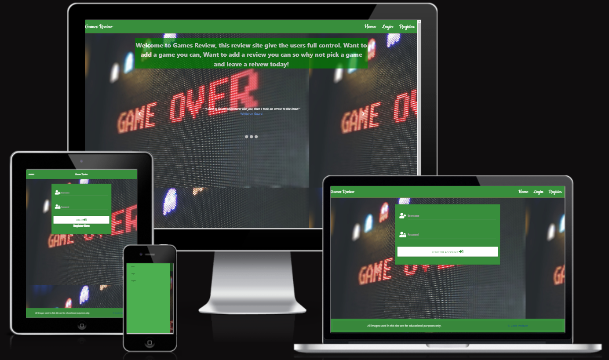

# Contents

* [**User Experience UX**](<#user-experience-ux>)
   * [User Stories](<#user-stories>)
   * [**Wireframes**](<#wireframes>)
   * [**Design Choices**](<#design-choices>)
       * [Color Scheme](<#color-scheme>)
   * [**Features**](<#features>)
       * [Home](<#Home>)
       * [Game](<#Game>)
       * [Publishers](<#Publishers>)
       * [Titles](<#Tiles>)
       * [Reviews](<#Reviews>)
       * [Profile](<#Profile>)
* [**Future Features**](<#future-features>)
* [**Technologies Used**](<#Technologies-Used>)
* [**Testing**](<#testing>)
* [**Deployment**](<#deployment>)
* [**Credits**](<#credits>)
* [**Content**](<#content>)
* [**Future Features**](<Future-Features>)
* [**Acknowledgements**](<#acknowledgements>)                

# User Experience (UX)

## User stories

 ### First time Vistor Goals 
1. As first time user i would like some information one what the site is and what the sites does.
2. The interface to be easy to use and self-explanatory. 
3. I want to be able to access the site on my phone and be easy to use while im using smaller devcies.
4. I would like to know if m was registration sucessful.

 ### Returning Vistor Goals   
1. I would like to be able to add and edit my comments that i post online and be able to delete them if i so require.
2. I have the ability to log out, and am notified when this is successful and i have logged out
3. I would like have a warning message appear before i delete any information form the site. 

 ### Frequent User Goals
1. when a user, logs in would like to know if i have been logged in correclty.
2. As returing user i want to know that my password is secured and that nobody can access it.
3. Restrictions on certians on the database so that i can cause my self any issues and have to contact the developer.

# Wireframes
The wireframes for ‘Games Review’ were produced in[Balsamiq](https://balsamiq.com).
There are frames for a full width display ( 1920 x 1080 package)and a small mobile 
device (360 x 640). The final site varies slightly from the wireframes due to bugs and design 
changes during development that occurred during the creation process. Mobile wireframes havent been included due to the use of Materialize as this
inculdes integrated responsivness package.

 

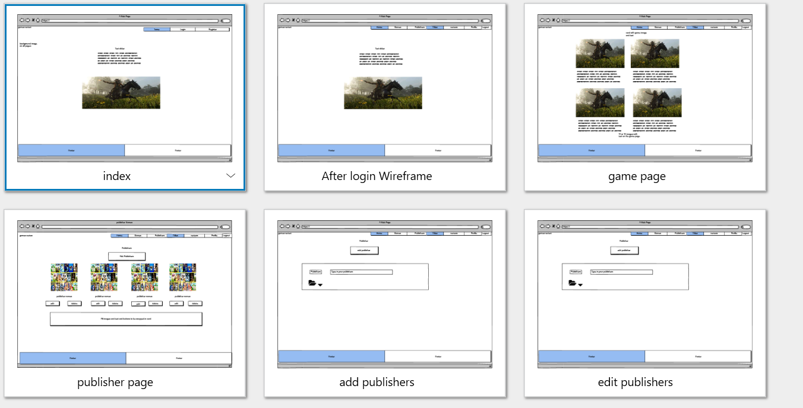
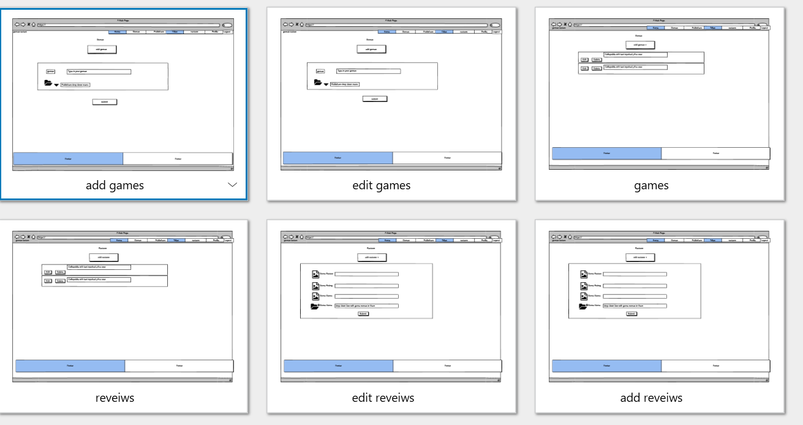
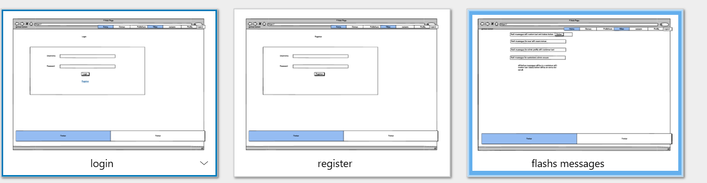

[Contents](<#contents>)

# Design Choices
 When designing the games reveiw database I wanted it to be to be simple to use, as I wanted the CRUD functionality to be present in the databse . Games review contains 13 pages which 11 pages related to Crud functions with in the database. After spending serval hours looking at Materialize i eventually decided on cards, collapsibles and a nav bar with a built in side nav bar for the desgin. I wanted the overall look of the side to feel simple and easy to use. All pages are linked up with either url`s or with buttons directing you to the different pages on the site.

 The nav bar covers all 13 pages of the site which is kept on the base template, across all the pages i have put in a background image which gives the site a nice contrasts from the text on the page. Early on in the design I knew i was going to use green for the overall look of the site, I orginally choose blue for the text, but due to it being difficult to see I changed the text colour scheme to white which stood out more. 

The game page was designed to give users ideas of games ideas that they can input into the database. All the images on the games page are for educational purposes only.
The design for the page comes from materialize cards which i edited the background to white and the text to a dark green colour.

During the final stages of devlepoment I choose to lock out users from deleting publishers as this ties all the relational database together. I wnated to give the uses so feed back and warining messages so i choose to implement flash messages.
 

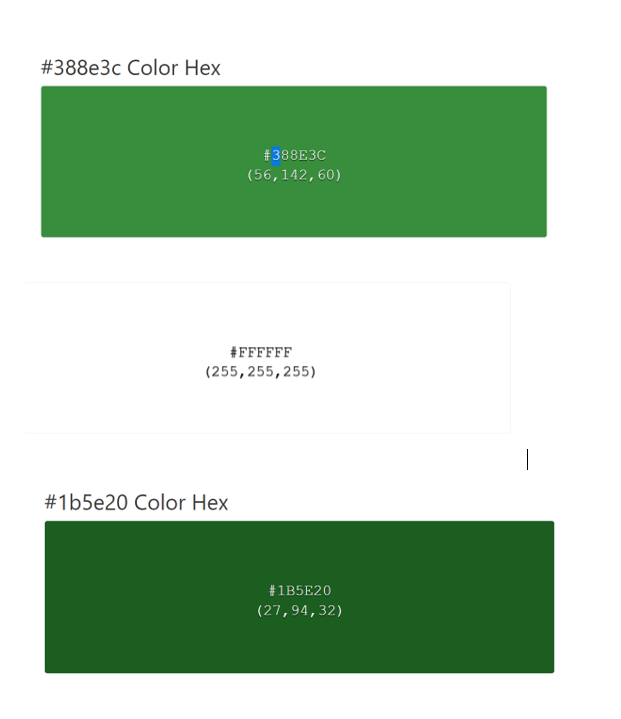
 
 
 THe colors that where choosen  are displayed in image above.

 Green darken 2 #388e3c was used for the nav bar footer and other elements with in the site

 Green darken 4 #1b5e20 was used for the text on the games page so the text would stand out. 
 
 White was used for a few various things backgrounds and text and flash messages.

 The buttons colours are red black and yellow.

  

[Contents](<#contents>)

# Features
### Home 
The home page features a nav bar which has lock function depending on whether you are logged or out. Below the nav bar you have a text slider with quotes from different video 
games, and below that you have and image slider with four different games images combined in to a single changing image, and a footer which covers all 13 pages. The image slider positioning is a small bug as it appears differntly on different devices.
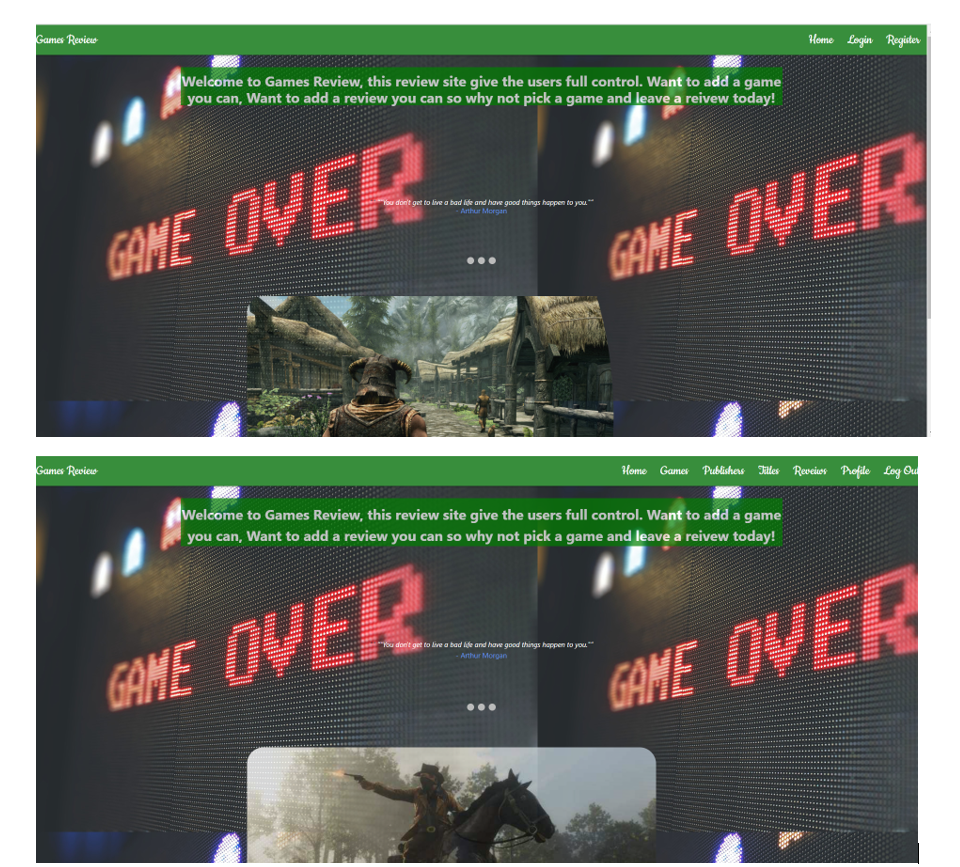

### Games
The game page features cards from materialize with different games images and a brief description of them.
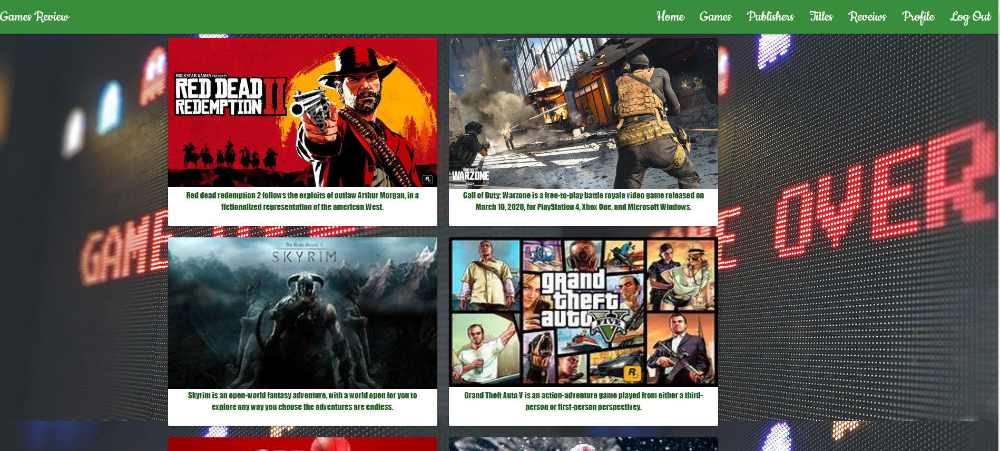

### Publishers
The publishers page is the key part of the database as you cant add anything in till you first add a publisher. The publishers page features a fully functioning Crud system with edit and delete
buttons but only admin can delete publishers.The publishers page also provides links to the add and edits pages so you user can edit if they change there minds.

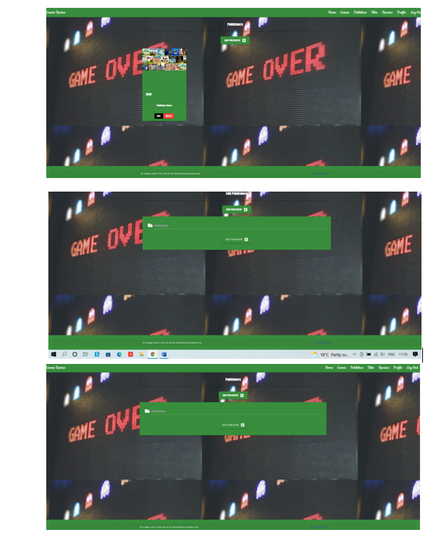

### Titles
The titles pages is where you can add games to the site, the titles page features collapsibles with the publisher names on the drop and in the drop down there is review, edit and delete buttons to give the user full access. The buttons provides links to the review page and edit games page. Users can delete games as they wish with a flash message appearing to warn them about deleting the games.

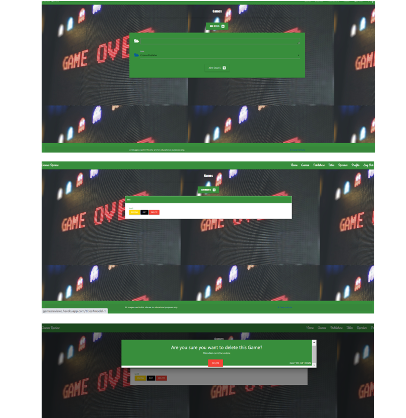

### Reviews
The Review pages is where you can add reveiws to the site, the reviews page features collapsibles with the game names on the drop and in the drop down there is edit and delete buttons to give the user full access. The buttons provides links to the review page and edit games page. Users can delete reviews as they wish with a flash message appearing to warn them about deleting the reviews. (bug game name wont appear i left out the jinja syntax for this reason)

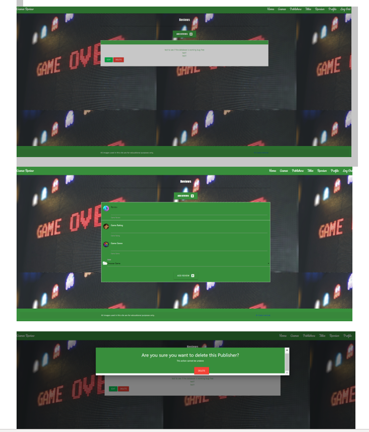

### Profile
The profile pages displays the use login details once they have registered on the site with a flash message.
the login and register page are very Similar the only differences are the text on the pages. The login and register pages are very simple in there design. 

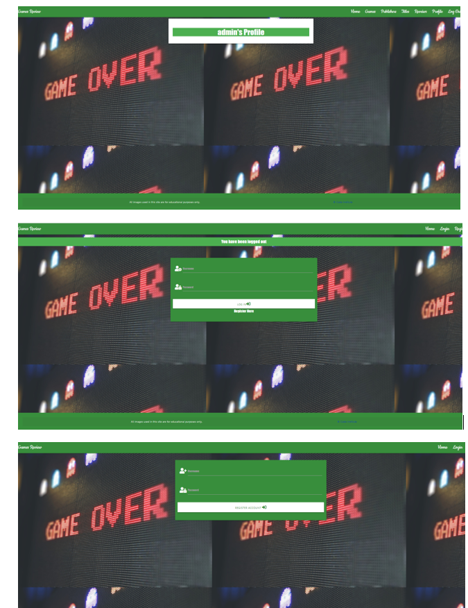

[Contents](<#contents>)

## Deployment

  ### **Deployment**

 This project was deployed to heroku and the steps to do this are below:

1. sign up and log into heroku
2. In the top right hand corner of the heroku website click new, then create new app
3. Name app and select region
4. click create app
5. Install postgres under the resources tab
6. Insert relevant config vars into heroku, such as IP,PORT,SECRET_KEY, DATABAS_URL
7. You can click connect to github but this project used the CLI method.
8. Log into heroku via CLI
9. Create a git remote for heroku
10. Push all changes to the staging area
11. Push to heroku for your app to run and function.
 
 # Technologies Used
   
* [HTML5](https://html.spec.whatwg.org/) -Used to create the contents and structure for the website.
* [CSS](https://www.w3.org/Style/CSS/Overview.en.html) -Used to create the styling.
* [Python3](https://en.wikipedia.org/wiki/Python_(programming_language)) Used to create the routes
* [Balsamiq](https://balsamiq.com/wireframes/) - Used to create the wireframes.
* [Gitpod](https://www.gitpod.io/#get-started) - Used to deploy the website.
* [Github](https://github.com/) - Used to host and edit the website code.
* [Code Beautify](https://codebeautify.org/jsvalidate) - To test and run the code
* [W3 Schools](https://validator.w3.org/)- To test the html and css code.
* [JavaScript (ES6)](https://open-vsx.gitpod.io/vscode/item?itemName=xabikos.JavaScriptSnippets)
* [ami responsive design](http://ami.responsivedesign.is) - To test out responsiness all devices
* [heroku](https://www.heroku.com) - Used for deployment
* [mongodb](https://www.mongodb.com) - Used for the user db 
* [PostgreSQL](https://en.wikipedia.org/wiki/PostgreSQL) User for the publisher games and reveiws db 
* [PEP8 Online Checker](http://pep8online.com/) Use to check python routes
* [Materialize](https://materializecss.com/) Used to create html templates

[Contents](<#contents>)

# Testing
 Please refer to [**_here_**](TESTING.md) for more information on testing 'Quiz Of The World'.

The live link will take you directly to **History Quiz** repository - https://github.com/Jon9851/History-Quiz
  
  # Clone  Repository
   To Clone a repository use the following steps to guide you throught it.
   1. Under the repository’s name, click on the code tab.
   2. click on the clipboard icon to copy the given URL.
   3. In your IDE of choice, open Git Bash.
   4. Change the current working directory to the location where you want the cloned directory to be made.
   5. Type git clone, and then paste the URL copied from GitHub.
   6. Press enter and the local clone will be created.

   

[Contents](<#contents>)

### Credits
1. W3schools- I used their tutorials on HTML and CSS for further understanding and troubleshooting  throughout my project.
2. Stack Overflow- I used Stack Overflow to get a more in depth understanding on HTML and CSS throughout my project.
3. Code Institute Example of the READ.MD- I used these as template when planning and writing my README file.
4.Code Institute tutors that helped me during my project.

[Contents](<#contents>)

# Acknowledgements
 
 The site was cerated for my milestone project 1 for the [Code Institute](https://codeinstitute.net/) Full Stack Software Developer diploma. I would like to thank all the tutors at the code institute for their help during the development of my first milestone project. I would aslo like to thank [Precious Ijege](https://www.linkedin.com/in/precious-ijege-908a00168/) for his guidence and help as his feedback was extremely key in completing my first milestone project.
 Brain Codex for help during the creation process. [Brian Codex](https://github.com/briancodex/quiz-app-js)