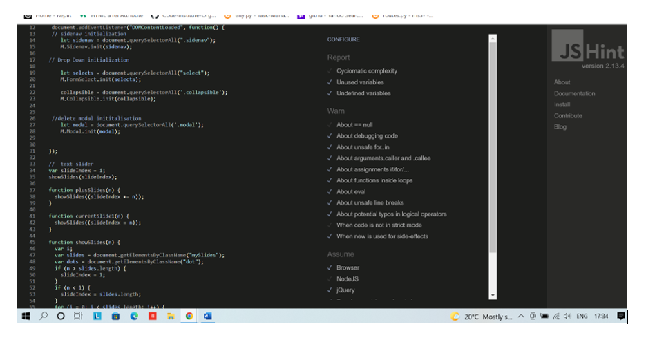

* [**Testing**](<#testing>)
* [**Manual Testing**](<#manual-testing>)
* [**Bugs**](<#bugs>)
* [**Accessibility**](<#accessibilty>)
# Testing
W3C markup validator and W3C CSS validator were used to test and validate all the code on all 4  pages of history quiz to ensure that there were no syntax errors. JS hint was used to test the Javascrpit and PEP8 online checker for python errors.

 # index
 The image below is testing for the index.html file. No errors or warnings are visible. 

 # Games
 The image below is testing for the instructions.html file. No errors or warnings are visible. 

 # Publishers
 The image below is testing for the game.html file. No errors or warnings are visible. 

 # Titles
 The image below is testing for the Score.html file. No errors or warnings are visible. 

)

# Reviews
 The image below is testing for the Score.html file. No errors or warnings are visible. 

# Profiles
 The image below is testing for the Score.html file. No errors or warnings are visible. 

# Errors 
During the testing of the sides code i came several warning error when running my code through w3 validator or javascript warning error. These error cant be removed as these are due to block contents being carried over from the html page or from Materialize. I have tired taking these error out but it breaks the code. For example the duplicate error on the html validation for the sidenav-bar. I have removed the duplicate attribute and the side navbar stopped working so i had to put the line of code back in.

# PEP8 Testing 
No issues found Materialize all code works.

# PEP8 Testing 
Some issues due using materialize 

# Build vs Pre Deployment 
| Test                                                            | Result                                                                    | Issue                         | Pass |
|-----------------------------------------------------------------|---------------------------------------------------------------------------|-------------------------------|------|
| Nav bar links work                                              | No issues found                                                           | N/a                           | Pass |
| Nav bar locks out when not logged in                            | Only home, log in and register are shown                                  | N/A                           | Pass |
| Images load in the correct position text                        | Images load in the correct position                                       | N/A                           | Pass |
| Publisher buttons can edit and delete                           | Edit and delete buttons work                                              | N/A                           | Pass |
| Titles collapsible function correctly                           | Collapsible works as intended                                             | N/A                           | Pass |
| Edit and Delete function work on all pages                      | Edit and delete functions work as intended admin function work correctly  | N/A                           | Pass |
| Flash messages appear on profile and when you delete something  | Messages appear                                                           | N/A                           | Pass |
| Admin restrictions function correctly                           | Admin functions work only admin can delete publishers                     | N/A                           | Pass |
| Publisher and games names appear on titles page                 | Publishers and game names appear on collapsible                           | N/A                           | Pass |
| Review and games names appear on review page                    | Review appear inside the collapsible but game don`t appear on the header  | Jinja not function correctly  | Fail |

### Deployed Testing
| Test                                                            | Result                                                                    | Issue                         | Pass |
|-----------------------------------------------------------------|---------------------------------------------------------------------------|-------------------------------|------|
| Nav bar links work                                              | No issues found                                                           | N/a                           | Pass |
| Nav bar locks out when not logged in                            | Only home, log in and register are shown                                  | N/A                           | Pass |
| Images load in the correct position text                        | Images load in the correct position                                       | N/A                           | Pass |
| Publisher buttons can edit and delete                           | Edit and delete buttons work                                              | N/A                           | Pass |
| Titles collapsible function correctly                           | Collapsible works as intended                                             | N/A                           | Pass |
| Edit and Delete function work on all pages                      | Edit and delete functions work as intended admin function work correctly  | N/A                           | Pass |
| Flash messages appear on profile and when you delete something  | Messages appear                                                           | N/A                           | Pass |
| Admin restrictions function correctly                           | Admin functions work only admin can delete publishers                     | N/A                           | Pass |
| Publisher and games names appear on titles page                 | Publishers and game names appear on collapsible                           | N/A                           | Pass |
| Review and games names appear on review page                    | Review appear inside the collapsible but game don`t appear on the header  | Jinja not function correctly  | Fail |
### User Feedback Testing 
| Test                                   | Result                              | Pass |
|----------------------------------------|-------------------------------------|------|
| Does the site work on smaller devices  | Site works fine on smaller devices  | Pass |
| Flash messages for registration        | Messages Appear                     | Pass |
| Log out functions works                | Function works                      | Pass |
| Restrictions on the database           | Admin functions work correctly      | PAss |
| Edit and delete buttons work           | Buttons work fine                   | Pass |
| Warning messages appear                | Messages appear                     | Pass |

### Responsiveness Testing 
| Responsiveness Test                           | Result                                                                    | Pass |
|-----------------------------------------------|---------------------------------------------------------------------------|------|
| Sidenav-bar appears on smaller devices        | Works correctly                                                           | Pass |
| Games Page cards resize on different devices  | Works correctly                                                           | Pass |
| Image slider displays in the centre           | Image slider appears in different locations depending on the device size  | Fail |
| Titles page                                   | Works correctly                                                           | Pass |
| Add Games Page                                | Works Correctly                                                           | Pass |
| Delete, edit and review buttons               | Works Correctly                                                           | Pass |
| Edit games page                               | Works Correctly                                                           | Pass |
| Publishers page                               | Works correctly                                                           | Pass |
| Edit publishers page                          | Works Correctly                                                           | Pass |
| Add publishers page                           | Works Correctly                                                           | Pass |
| Review page                                   | Works Correctly                                                           | Pass |
| Edit review page                              | Works Correctly                                                           | Pass |
| Add Review page                               | Works Correctly                                                           | Pass |
| Login, register and profile page              | Works Correctly                                                           | Pass |
| Flash messages resize                         | Works Correctly                                                           | Pass |
| Flash buttons resize                          | Button alignments slightly off                                            | Fail |

# BUGS
The original  design for the Games reviews has changed a lot due to bugs and learning curves i faced during the development of this project. 

  1. Image slider positioning on different devices, cant work out how to keep it centered.
  2. Game name on the review page wont appear jinja syntax taken out 
  3. flash delete buttons slightly off centered.  

# Accessibility
Accessibility was tested on lighthouse during the development of  game review The results are displayed below. There are some discrepancies on the light house depending on what 
page you are on the site. I have attempted  to fix this but all i did was break the site. I have tired to sort some of these issues out but due to me reaching my build limit im unable to fix the rest of the issues.

